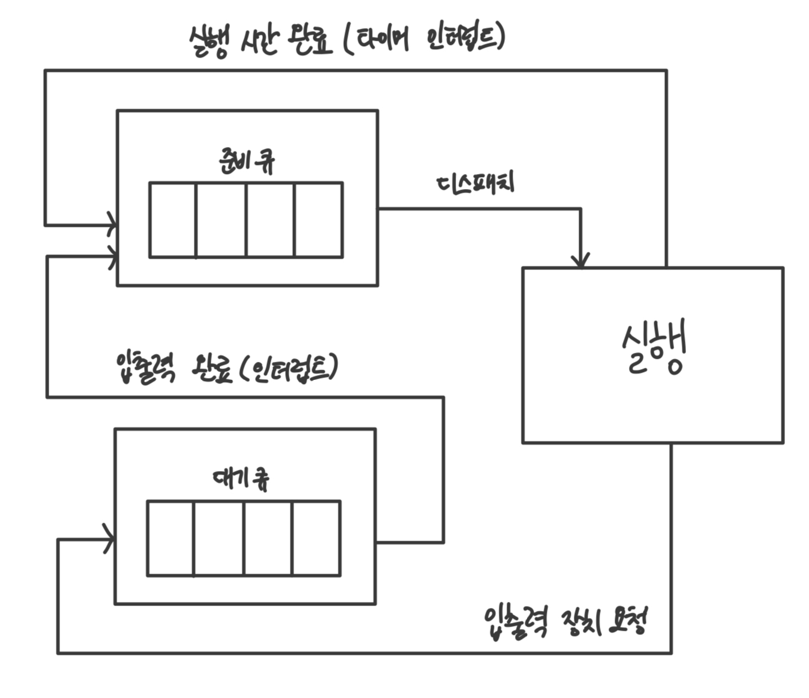

# CPU 스케줄링

- 운영체제가 프로세스들에게 공정하고 합리적으로 CPU 자원을 배분하는 것

## 프로세스 우선순위

- PCB에 저장됨

- 우선순위가 높으면 더 빨리, 더 자주 실행됨

- 사용자 조작 가능

- 입출력 집중 프로세스(I/O bound process) : 입출력 작업이 많은 프로세스

- CPU 집중 프로세스(CPU bound process) : CPU 작업이 많은 프로세스

- 일반적으로는 입출력 집중 프로세스가 CPU 집중 프로세스보다 우선순위가 높음

## 스케줄링 큐(Scheduling Queue)

- 매번 우선순위를 찾기 위해 모든 프로세스의 PCB를 확인하는 것은 비효율적이므로 스케줄링 큐 사용

- 각 자원을 이용하기 위해 자원 별로 큐에서 대기

- FIFO(First In First Out)일 필요 없음

- 같은 큐 내에서 우선순위 별로 처리

- 준비 큐(ready queue) : CPU를 이용하고자 하는 프로세스들이 서는 줄

- 대기 큐(waiting queue) : 입출력장치를 이용하기 위해 대기 상태에 접어든 프로세스들이 서는 줄

## 선점형 스케줄링과 비선점형 스케줄링

- 선점형 스케줄링(preemptive scheduling) 
  
  - 프로세스가 CPU를 비롯한 자원을 사용하고 있더라도 운영체제가 프로세스로부터 강제로 자원을 빼앗아 다른 프로세스에 할당
  
  - 프로세스마다 정해진 시간만큼 CPU를 이용하고 타이머 인터럽트가 발생하면 운영체제가 해당 프로세스로부터 자원을 빼앗아 다음 프로세스에 할당
  
  - 자원 독점을 막고 고른 배분 가능
  
  - 문맥 교환 과정에서 오버헤드 발생 가능

- 비선점형 스케줄링(non-preemptive scheduling)
  
  - 한 프로세스가 자원을 사용하고 있다면 그 프로세스가 종료되거나 대기 상태에 접어들 때까지 다른 프로세스가 끼어들 수 없는 스케줄링
  
  - 하나의 프로세스가 자원 사용을 독점함
