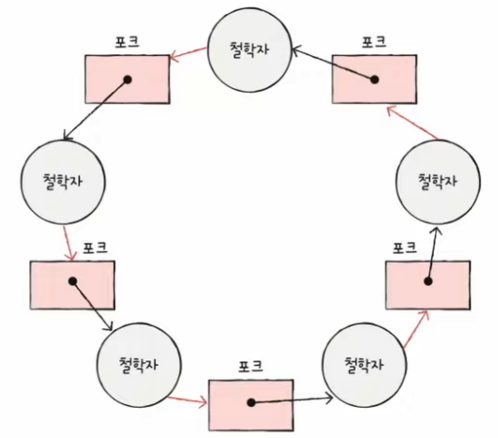

# 교착 상태

## 교착 상태 (deadlock)

- 식사하는 철학자 문제 (dining philosophers problem)
  
  

- 일어나지 않을 사건을 기다리며 진행이 멈춰버리는 현상

## 자원 할당 그래프 (resource-allocation graph)

1. 프로세스는 원으로, 자원의 종류는 사각형으로 표현

2. 사용 가능한 자원의 개수는 사각 형 내에 점으로 표현

3. 프로세스가 자원을 할당받아 사용 중이라면 자원에서 프로세스로 화살표 표시

4. 프로세스가 자원을 기다리는 중이라면 프로세스에서 자원으로 화살표 표시
- 교착 상태 발생 조건 파악 가능
  
  - 어떤 프로세스가 어떤 자원을 할당받아 사용 중인지 확인 가능
  
  - 어떤 프로세스가 어떤 자원을 기다리고 있는지 확인 가능

- 교착 상태가 일어난 자원 할당 그래프의 특징 => **원의 형태**를 띄고 있음

## 교착 상태 발생 조건

- **네 조건을 모두 만족**했을 때 교착 상태가 발생함

- **상호 배제 (mutual excclusion)**
  
  - 한 프로세스가 사용하는 자원을 다른 프로세스가 사용할 수 없는 상태

- **점유와 대기 (hold and wait)**
  
  - 자원을 할당 받은 상태에서 다른 자원을 할당 받기를 기다리는 상태

- **비선점 (nonpreemptive)**
  
  - 어떤 프로세스도 다른 프로세스의 자원을 강제로 뺏지 못하는 상태

- **원형 대기(circular wait)**
  
  - 프로세스들이 원의 형태로 자원을 대기하는 상태
