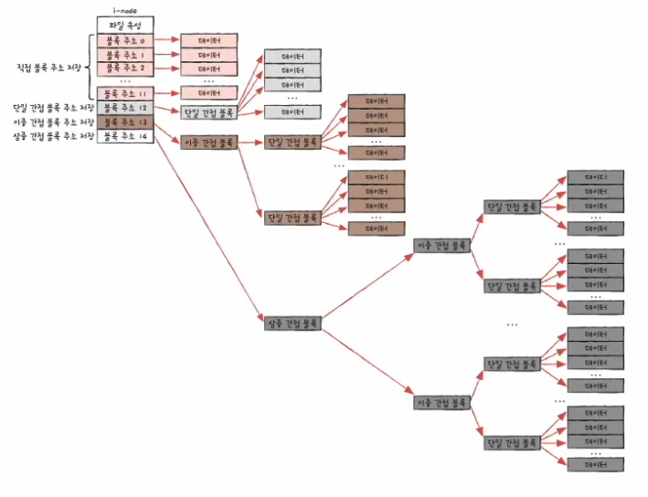

# 파일 시스템

## 파일 시스템(file system)

- 파일과 디렉터리를 관리하는 OS 내의 프로그램

- 파일과 디렉터리를 다루어주는 프로그램

- 파일과 디렉터리를 보조기억장치에 할당하고 접근하는 방법

## 파티셔닝과 포매팅

- **파티셔닝(partitioning)**
  
  - 저장 장치의 논리적인 영역을 구획하는 작업

- **포매팅(formatting)**
  
  - 어떤 방식으로 파일을 관리할지 결정하고 새로운 데이터를 쓸 준비를 하는 작업
  
  - 파일 시스템을 설정하는 것
  
  - 파티션마다 다른 파일 시스템을 설정할 수도 있음

## 파일 할당 방법

- OS는 파일과 디렉터리를 **블록** 단위로 읽고 씀
  
  - HDD의 가장 작은 저장 단위는 섹터지만 보통 섹터를 묶어 블록 단위로 사용함
  
  - 하나의 파일이 보조기억장치에 저장될 때는 여러 블록에 걸쳐 저장됨

- **연속 할당(contiguous allocation)**
  
  - 보조기억장치 내 **연속적인 블록**에 파일을 저장하는 방식
  
  - **파일에 접근하기 위해 필요한 정보 = 첫번째 블록 주소 + 블록 단위 길이**
  
  - **디렉터리 엔트리 = 파일명 + 첫번째 블록 주소 + 블록 단위 길이**
  
  - **외부 단편화** 야기

- **불연속 할당**
  
  - **연결 할당(linked allocation)**
    
    - 각 블록의 일부에 다음 블록을 주소를 저장해 각 블록이 다음 블록을 가리키는 형태로 할당
    
    - 파일을 이루는 데이터 블록을 **연결 리스트**로 관리
    
    - **디렉터리 엔트리 = 파일명 + 첫번째 블록 주소 + 블록 단위 길이**
    
    - 반드시 첫번째 블록부터 하나씩 읽어야 함
      
      - 임의 접근 속도가 매우 느림
    
    - 오류 발생 시 해당 블록 이후 블록은 접근 불가
  
  - **색인 할당(indexed allocation)**
    
    - 파일의 모든 블록 주소를 색인 블록(index block)이라는 하나의 블록에 모아 관리하는 방식
    
    - 파일 내 임의의 위치에 접근하기 용이
    
    - **디렉터리 엔트리 = 파일명 + 색인 블록 주소**

## FAT 파일 시스템

- 연결 할당 기반 + 단점을 보완한 파일 시스템
  
  - 다음 블록의 주소를 각자 가지고 있는게 아니라 **테이블**로 보관

- **파일 할당 테이블(FAT; File Allocation Table)**
  
  - 각 블록에 포함된 다음 블록 주소를 모아둔 테이블

- FAT를 메모리에 캐시한다면 느린 임의 접근 속도 개선 가능

- **FAT FS = 예약 영역 + FAT 영역 + 루트 디렉터리 영역 + 데이터 영역**
  
  - 예약 영역 : 예약된 데이터 저장
  
  - FAT 영역 : FAT 저장
  
  - 루트 디렉터리 영역 : 루트 디렉터리의 데이터 저장
  
  - 데이터 영역 : 나머지 데이터 저장

- **디렉터리 엔트리 = 파일명 + 확장자 + 속성 + 예약 영역 + 생성 시간 + 마지막 접근 시간 + 마지막 수정 시간 + 시작 블록 + 파일 크기**

## UNIX 파일 시스템

- 색인 할당 기반 파일 시스템

- **색인 블록 == i-node**
  
  - i-node(index-node)
    
    - 파일의 속성 정보와 15개의 블록 주소 저장 가능
    
    - 15개 중 12개의 주소에는 **직접 블록(direct block) 주소** 저장
    
    - 13번째 주소에는 **단일 간접 블록(single indirect block) 주소** 저장
      
      - 단일 간접 블록 주소 : 데이터를 저장한 블록의 주소
    
    - 14번째 주소에는 **이중 간접 블록(double indirect block) 주소** 저장
      
      - 이중 간접 블록 주소 : 단일 간접 블록의 주소
    
    - 15번째 주소에는 **삼중 간접 블록(triple indirect block) 주소** 저장
      
      - 삼중 간접 블록 주소 : 이중 간접 블록의 주소
    
    - **12 직접 블록 + 1 단일 간접 블록 + 1 이중 간접 블록 + 1 삼중 간접 블록**
    
    

- **UNIX FS = 예약 영역 + i-node 영역 + 데이터 영역**

- **디렉터리 엔트리 = i-node 번호 + 파일명**

- FAT FS처럼 루트 디렉터리를 따로 저장하지는 않지만 파일 시스템이 자체적으로 루트 디렉터리의 i-node를 항상 기억하고 있음

