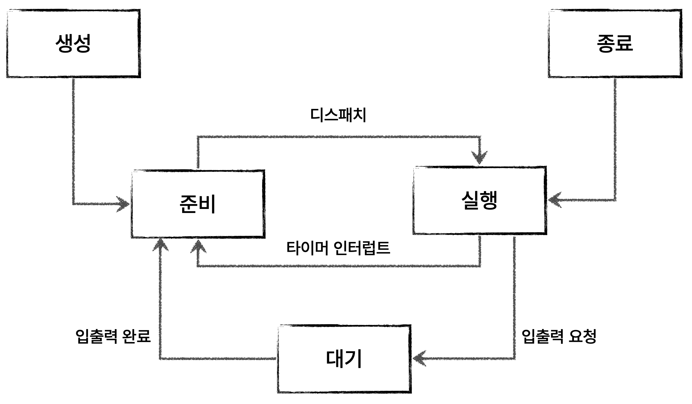

# 프로세스 상태와 계층 구조

## 프로세스 상태

- **생성(new)**
  
  - 메모리에 적재되어 PCB를 할당받은 상태

- **준비(ready)**
  
  - CPU를 할당받아 실행할 수 있지만 차례를 기다리는 상태
  
  - 디스패치(dispatch) : 준비 상태인 프로세스가 실행 상태로 전환되는 것

- **실행(running)**
  
  - CPU를 할당받아 실행 중인 상태
  
  - 타이머 인터럽트가 발생하면 준비 상태로 전환
  
  - 실행 도중 입출력 작업이 필요하다면 대기 상태로 전환

- **대기(blocked)**
  
  - 입출력장치의 작업을 기다리는 상태
  
  - 입출력 작업이 끝나면 준비 상태로 전환

- **종료(terminated)**
  
  - 프로세스가 종료된 상태
  
  - OS는 PCB와 프로세스가 사용한 메모리 정리

- 프로세스 상태 다이어그램
  
  

## 프로세스 계층 구조

- 부모 프로세스(parent process) : 새 프로세스를 생성한 프로세스

- 자식 프로세스(child process) : 부모 프로세스에 의해 생성된 프로세스
  
  - PPID(Parent PID)를 기록하는 OS도 있음

## 프로세스 생성 기법

- 부모 프로세스는 `fork`를 통해 자신의 복사본을 자식 프로세스로 생성

- 자식 프로세스는 `exec`를 통해 자신의 메모리 공간을 다른 프로그램으로 교체

- **fork**
  
  - 자기 자신의 복사본을 만드는 시스템 호출
  
  - 부모 프로세스의 자원이 상속됨

- **exec**
  
  - 자신의 메모리 공간을 새로운 프로세스로 덮어쓰는 시스템 호출
    
    - 코드 영역과 데이터 영역은 실행할 프로그램의 내용으로 바뀜
    
    - 나머지 영역은 초기화됨
    
