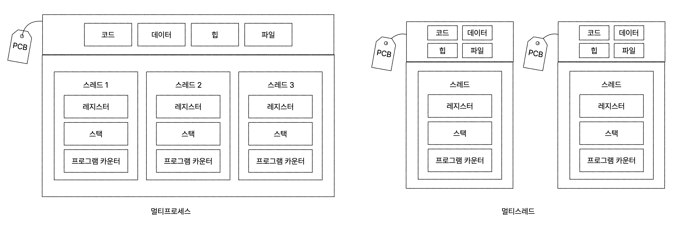

# 스레드

## 스레드

- 프로세스를 구성하는 실행 흐름의 단위

- 하나의 프로세스는 여러 개의 스레드를 가질 수 있음

- 같은 프로세스 내의 스레드는 프로세스의 자원을 공유함

- 구성 요소 : 스레드 실행에 필요한 최소한의 정보
  
  - 스레드 ID
  
  - 프로그램 카운터 값을 비롯한 레지스터 값
  
  - 스택

## 멀티프로세스 vs 멀티스레드

- 멀티프로세스
  
  - 여러 프로세스를 동시에 실행하는 것
  
  - 자원의 공유하지 않음
    
    - 프로세스간 통신을 할 수도 있음 => 프로세스 간 통신(IPC; Inter-Process Communication)

- 멀티스레드
  
  - 여러 스레드로 프로세스를 동시에 실행하는 것
  
  - 같은 프로세스 내의 자원을 공유함

